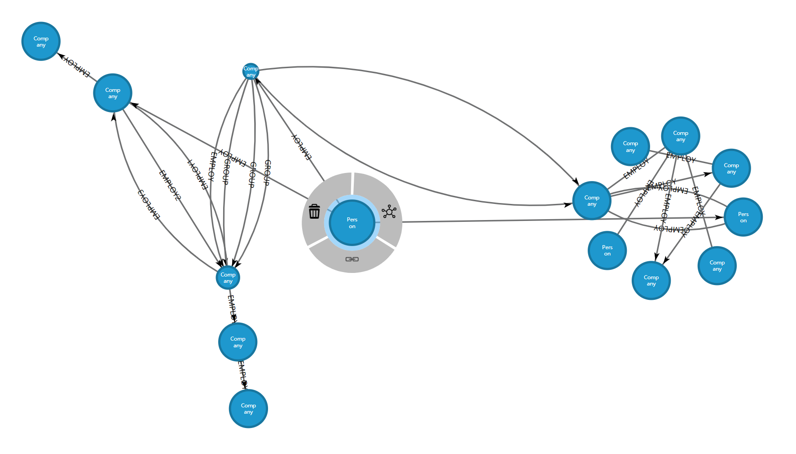
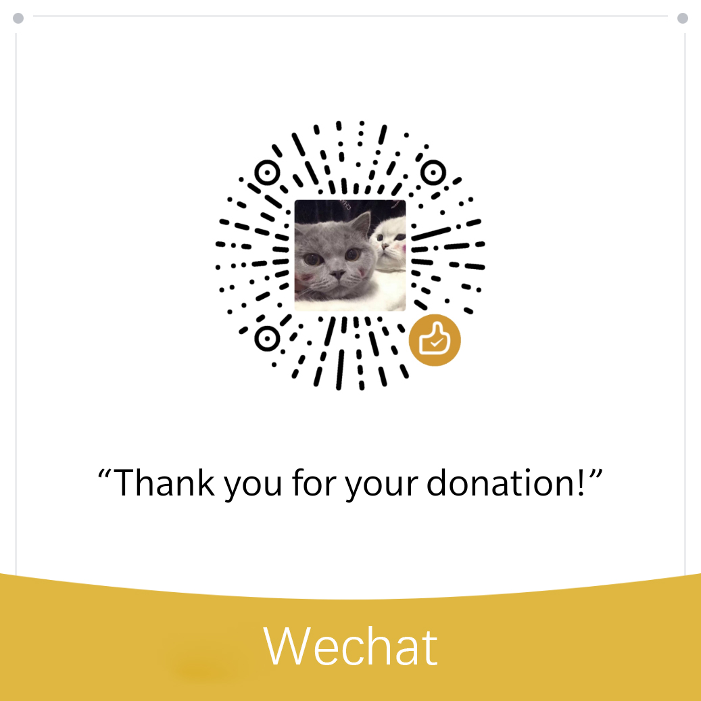

# NetworkGraph


  


  


  

如果对您有帮助，请点击 <b>Star</b> 支持开发者

## 一、项目预览
[](http://148.70.238.152/)  

## 二、功能简介
- ### 快捷菜单栏(上)
  下载示例数据、上传数据进行分析、导出编辑后的数据、导出图片、布局计算 开始/结束 控制、查找节点、全屏切换、以及留言、公共数据集、路径分析、图参数调节面板的显隐控制
- ### 快捷工具栏(左上)
  网络图缩放、旋转
- ### 可视控制区(左下)
  对网络图提示框、分类统计图、节点内文字、关系文字、关系箭头、贴心小提示进行显隐控制
- ### 调色区(下)
  对节点颜色进行更改  
  注：先选中后才能更改
- ### 留言面板(右)
  对项目留言
- ### 公共数据集选择面板(右)
  选择公共数据集进行可视化分析
- ### 路径分析面板(右)
  输入两个节点的 index 进行路径分析
- ### 图参数调节面板(右)
  对网络图的节点间斥力、连接强度、节点和边的缩放比例、边的类型、网络图布局方式、分析模式以及对背景颜色或图片进行调整，也可对批量节点的大小、透明度、边的宽度进行调节  
  注：需先进行节点和边的选中，方可调节
- ### 右键菜单
  - 右键点击空白区域，可进行节点创建
  - 右键点击关系，可进行关系打破
  - 右键点击节点，可进行节点扩展、节点删除、构建关系以及按条件选取
## 三、项目部署
- ### linux
  #### 安装 python3 运行环境
  1、yum install python36...  
  2、yum install pip36...  
  3、pip install django  
  4、pip install py2neo
  #### 安装java jdk
  5、yum install java-1.8.0-openjdk
  #### 安装neo4j
  6、wget https://neo4j.com/artifact.php?name=neo4j-community-3.4.12-unix.tar.gz  
  7、tar -xzvf neo4j-community-3.4.12-unix.tar.gz
  #### 导入数据
  8、neo4j-admin import --nodes nodes.csv --relationships links.csv
  #### 修改neo4j配置 远程访问并修改密码
  9、vim neo4j.conf  
  10、把54行dbms.connectors.default_listen_address=0.0.0.0注释去掉  
  11、远程访问neo4j数据库 http://IP:7474/ 修改初始密码
  #### 拉取代码
  12、git clone https://github.com/iaboaix/NetworkGraph.git
  #### 启动 neo4j 和 django
  13、neo4j start  
  14、nohup python3 manage.py runserver --insecure 0.0.0.0:80 &  
  15、访问 http://127.0.0.1/
- ### windows
  #### 安装 python3 运行环境
  1、安装python3.x  
  2、安装python包  
  3、pip install django  
  4、pip install py2neo
  #### 安装java jdk
  5、下载地址  
  https://www.oracle.com/technetwork/java/javase/downloads/jdk8-downloads-2133151.html
  #### 安装neo4j
  6、下载地址  
  https://neo4j.com/download/  
  7、导入数据  
  neo4j-admin import --nodes nodes.csv --relationships links.csv  
  8、访问neo4j数据库并修改初始密码  
  http://127.0.0.1:7474/  
  修改初始密码为xxxxxx
  #### 拉取代码
  9、git clone https://github.com/iaboaix/NetworkGraph.git
  #### 启动neo4j django
  10、neo4j start  
  11、python3 manage.py runserver --insecure 0.0.0.0:80  
  12、访问 http://127.0.0.1/
- ### tips:
  1、启动之前，将服务器外网IP地址加入 django settings.py 的 ALLOWED_HOSTS  
  2、若 django sqlite 报错  
&nbsp;&nbsp;&nbsp;&nbsp;&nbsp;&nbsp;vim /usr/local/lib64/python3.6/site-packages/django/db/models/base.py  
&nbsp;&nbsp;&nbsp;&nbsp;&nbsp;&nbsp;将版本检测代码段注释掉  
  3、若 django debug = false 之后 静态文件找不到 启动时添加 --insecure  

## 四、NetworkGraph.min.js模块使用方法

### 下载最新模块
[NetworkGraph.min.js](others/NetworkGraph/NetworkGraph.min.js)

### 示例代码
```html
<!DOCTYPE html>
<html lang="en">
<head>
    <meta charset="UTF-8">
    <meta name="viewport" content="width=device-width, initial-scale=1.0">
    <meta http-equiv="X-UA-Compatible" content="ie=edge">
    <script type="text/javascript" src="d3.js"></script>
    <script type="text/javascript" src="NetworkGraph.min.js"></script>
    <style>
        html {
            height: 100%;
        }
        body {
            width: 100%;
            height: 100%;
        }
        #vis {
            width: 100%;
            height: 100%;
            margin: 0 auto;
        }
    </style>
    <title>NetworkGraph</title>
</head>
<body>
    <svg id="vis"></svg>
    <script>
        var data0 = {
            "nodes": [
                { "id": 0, "label": "Person",  "size": 30 },
                { "id": 1, "label": "Company", "size": 10 },
                { "id": 2, "label": "Company", "size": 15 },
                { "id": 3, "label": "Company" },
                { "id": 4, "label": "Company", "size": 17 },
                { "id": 5, "label": "Company", "size": 40 },
                { "id": 6, "label": "Company", "size": 35 }
            ],
            "links": [
                { "type": "EMPLOY", "source": 0, "target": 1 },
                { "type": "EMPLOY", "source": 0, "target": 1 },
                { "type": "EMPLOY", "source": 1, "target": 0 },
                { "type": "EMPLOY", "source": 1, "target": 2 },
                { "type": "EMPLOY", "source": 2, "target": 3 },
                { "type": "EMPLOY", "source": 0, "target": 2 },
                { "type": "EMPLOY", "source": 3, "target": 4 },
                { "type": "EMPLOY", "source": 3, "target": 4 },
                { "type": "EMPLOY", "source": 3, "target": 6 },
                { "type": "EMPLOY", "source": 5, "target": 0 },
                { "type": "EMPLOY", "source": 3, "target": 0 },
            ]
        };
        var data1 = {
            "nodes": [
                { "id": 10, "label": "Person"  },
                { "id": 11, "label": "Company" },
                { "id": 12, "label": "Company" },
                { "id": 13, "label": "Company" },
                { "id": 14, "label": "Person"  },
                { "id": 15, "label": "Company" },
                { "id": 16, "label": "Company" },
                { "id": 17, "label": "Company" }
            ],
            "links": [
                { "type": "EMPLOY", "source": 10, "target": 11 },
                { "type": "EMPLOY", "source": 11, "target": 12 },
                { "type": "EMPLOY", "source": 12, "target": 13 },
                { "type": "EMPLOY", "source": 12, "target": 14 },
                { "type": "EMPLOY", "source": 15, "target": 16 },
                { "type": "EMPLOY", "source": 17, "target": 15 },
                { "type": "EMPLOY", "source": 11, "target": 15 },
                { "type": "EMPLOY", "source": 12, "target": 16 }
            ]
        };
        var links = [
            { "source": 0 , "target": 10, "type": "" },
            { "source": 1 , "target": 11, "type": "" },
            { "source": 11, "target": 1 , "type": "" }
        ];
        var network_graph = new NetworkGraph("vis");
        var graph0 = network_graph.drawNetworkGraph(data0, "force", 300, 400);
        var graph1 = network_graph.drawNetworkGraph(data1, "radius", 900, 400);
        graph1.connectGraph(graph0, links);
        var node0 = {
            "id": 100,
            "label": "Company",
            "size": 50,
        };
        var node1 = {
            "id": 101,
            "label": "Company",
            "size": 30,
        };
        setTimeout(() => {
            // network.addNode(node);
            // network.addNode(node, x, y);
            graph0.addNode(node0, 100, 200);
            graph1.addNode(node1, 100, 200);
        }, 1000);
        setTimeout(() => {
            // network.addLink(node,    node,    node_type);
            // network.addLink(node_id, node_id, node_type);
            // network.addLink(node,    node_id, node_type);
            // network.addLink(node_id, node,    node_type);
            graph0.addLink(node0, 3, "TEST");
            graph1.addLink(node1, 16, "TEST");
        }, 2000);
        setTimeout(() => {
            // network.removeLink(link);
            graph0.removeLink(data0.links[0]);
            graph0.removeNode(5);
            graph1.removeLink(data1.links[2]);
            graph1.removeNode(15);
        }, 3000);
    </script>
</body>
</html>
```
### 使用效果


## 五、点击加入QQ群: [D3网络图可视化](https://jq.qq.com/?_wv=1027&k=5oRv4zr)  

## 六、[Sponsor-赞助](Sponsor)
&nbsp;&nbsp;&nbsp;&nbsp;&nbsp;&nbsp;&nbsp;&nbsp;